# Project Name

Particle simulation supported by threading and SFML library.

## Table of Contents

- [Introduction](#introduction)
- [Installation](#installation)

## Introduction

This application simulates bouncing particles. There are 3 different ways to spawn the particle. First is specifying the starting line where particles spawn. Second is specifying 2 angles where particle are arranged. Lastly each particles will have different velocity. In addition to controlling the parameters or constants, the application allows you to switch between explorer mode and developer mode. Developer mode is responsible for controlling the behavior of particle spawn. While explorer mode displays the periphery of the sprite, which is distinguished as red circular ball. During the explorer mode, the user can dictate the movement of sprite using keys w (up), a (left), s (down), d (right). To switch between two modes, tick the checkbox as indicated in the images below.

### Explorer Mode

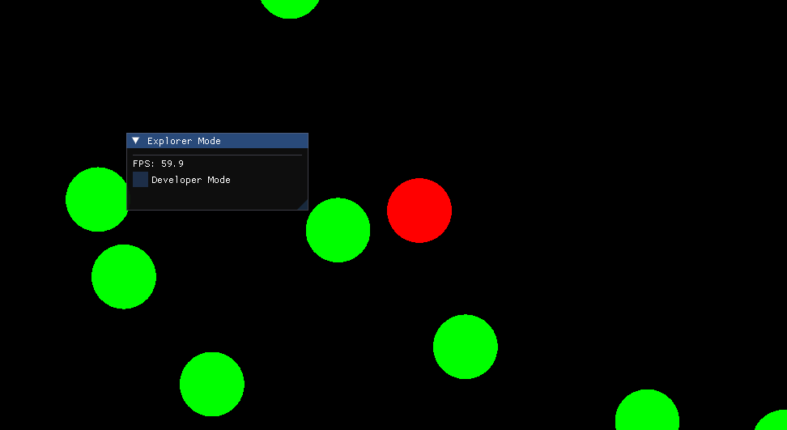
_Explorer Mode_

### Developer Mode

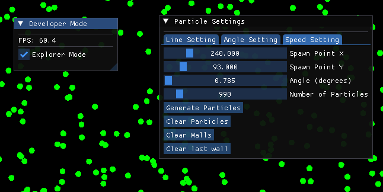
_Developer Mode_

### Feature 1: Equidistant Line Segments

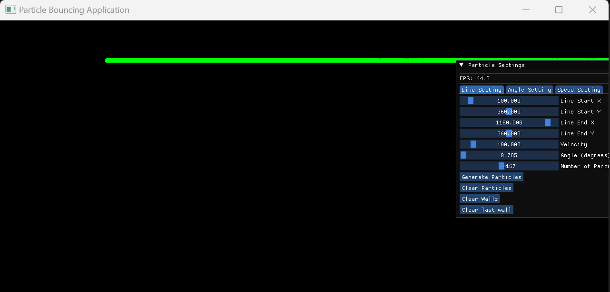
_1st batch_

### Feature 2: Equidistant Angle


_2nd batch_

### Feature 3: Equidifferent Speed

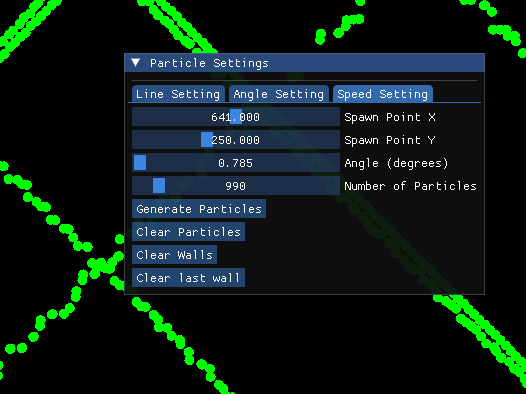
_3rd batch_

## Installation

The required IDE to run this application is VS2022. Please be reminded that this application is not compatible with the VS2019.

To compile the cpp file clone or download this repository. Open the solution folder inside `Problem-Set3` and then follow the guide below to update the directories inside the project property. All external libraries are contained in this repo.

1. **Project directory**

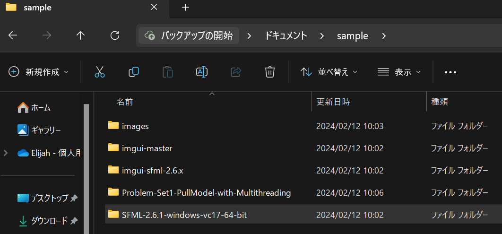
_Your current directory should look like this_

2. **General Configuration**

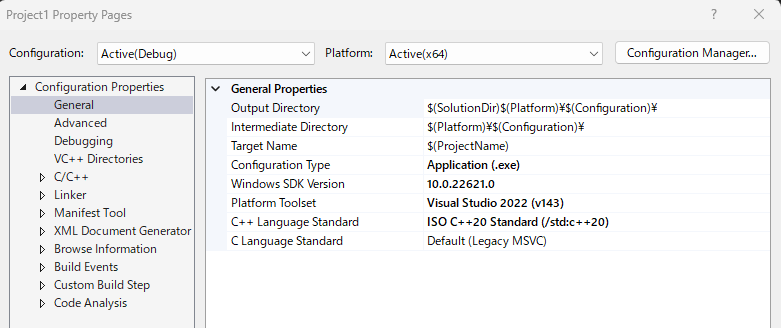
_The Visual Studio must be version 2022 running on a C++20 compiler_

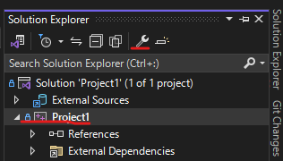
_Click the setting icon as indicated in the image. For `Problem-Set3` folder there are 3 solution files expected, namely Client1, Client2, and Server. Click any of the item to start the configuration_

3. **VC++ Directories**

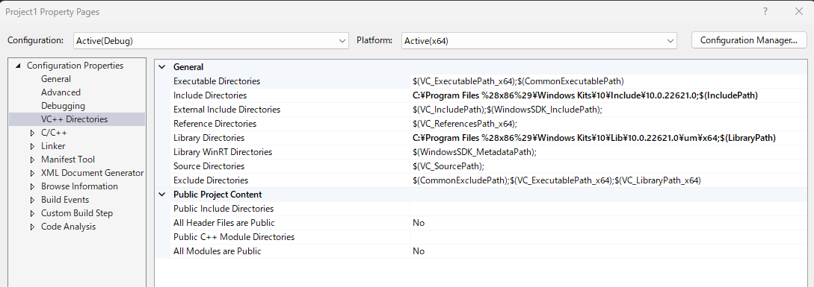
_Check the Include and Library directories and change them according to your machine's specifications_

4. **Configure C++**
   v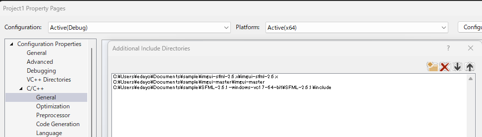

5. **Configure Linker/General**

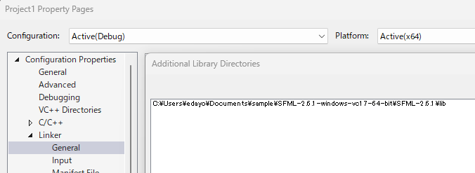

6. **Configure Linker/Input**

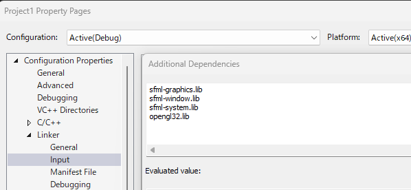

7. **Repeat step 2-6 in other solution folders**
   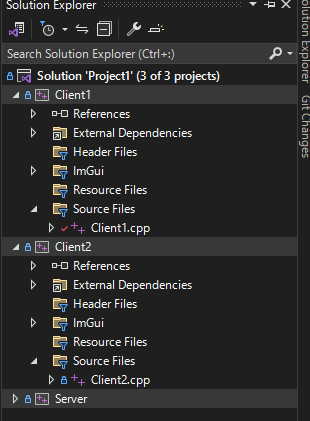

8. **Copy the required DLL files**

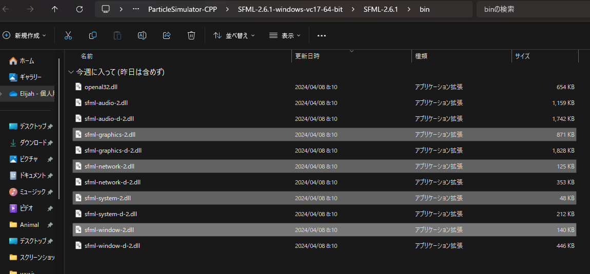
_You need `sfml-graphics-2.dll`, `sfml-system-2.dll`, `sfml-network-2.dll`, and `sfml-window-2.dll` pasted in the directory where the executable file is located_

9. **Paste the files to the application folder**

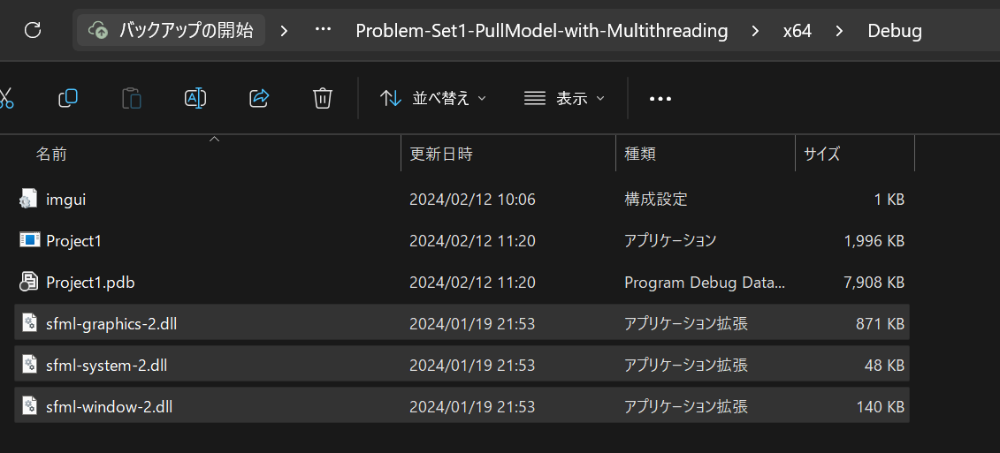
_Copy paste the above dll files to following directories

    ```bash
    C:\your_address\ParticleSimulator-CPP\Problem-Set3\Problem-Set3\x64\Debug

    C:\your_address\ParticleSimulator-CPP\Problem-Set3\Problem-Set3\Client1\x64\Debug

    C:\your_address\ParticleSimulator-CPP\Problem-Set3\Problem-Set3\Client2\x64\Debug
    ```

Now the IDE can compile and run the particle simulator application\_
