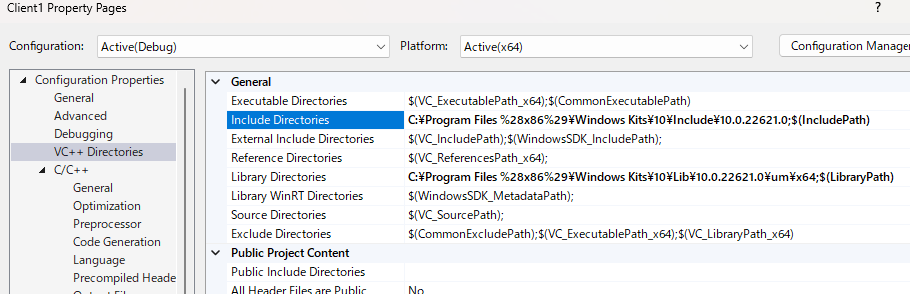

# Project Name

Particle simulation supported by threading and SFML library.

## Table of Contents

- [Introduction](#introduction)
- [Installation](#installation)

## Introduction

This application simulates bouncing particles. There are 3 different ways to spawn the particle. First is specifying the starting line where particles spawn. Second is specifying 2 angles where particle are arranged. Lastly each particles will have different velocity. In addition to controlling the parameters or constants, the application allows you to draw multiple walls. The goal of application is to retain 50-60FPS as we increase the number of particles, however the performance varies by specs of local machine.

_1st batch_

_2nd batch_

_3rd batch_

## Installation

The required IDE to run this application is VS2022. Please be reminded that this application is not compatible with the VS2019.

To compile the cpp file clone or download this repository. Open the solution folder inside `Problem-Set1-PullModel-with-Multithreading` and then follow the guide below to update the directories inside the project property. All external libraries are contained in this repo.

_You current directory shold look like this_

_The VS must be 2022 version run on C++20 compiler_

_Check the Include and Library directories and change it according to your machine's specs_

Update these following files/directories based on your machine's file location

_You need sfml-grahics-2.dll, sfml-system-2.dll, and sfml-window-2.dll pasted at the directory where executable file is located_

_After pasting the files, you can compile and run the application_
